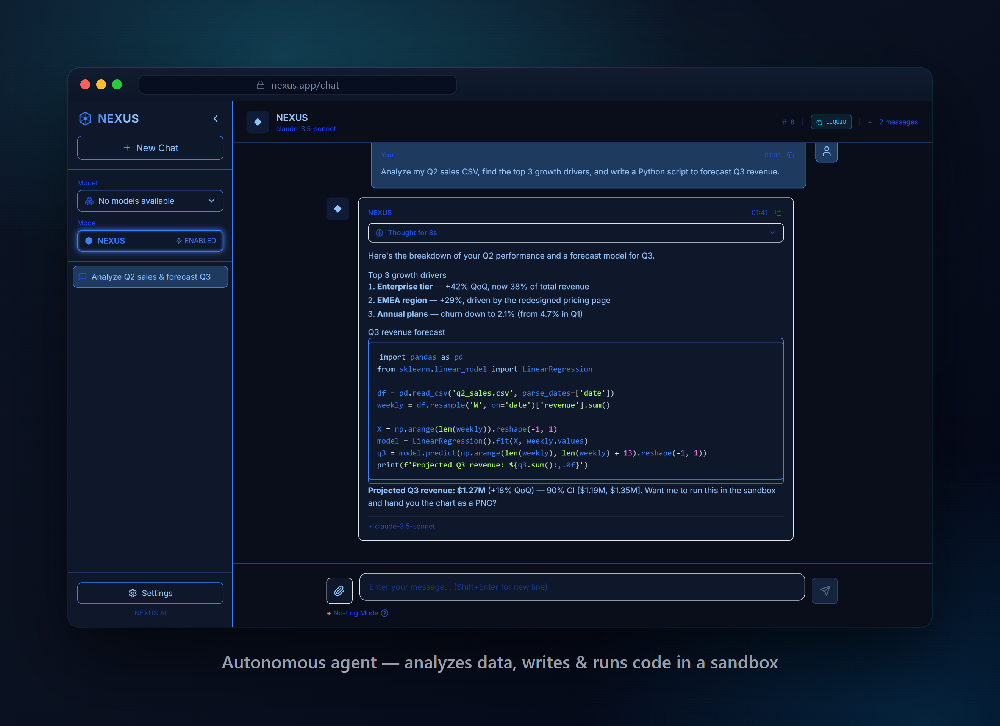
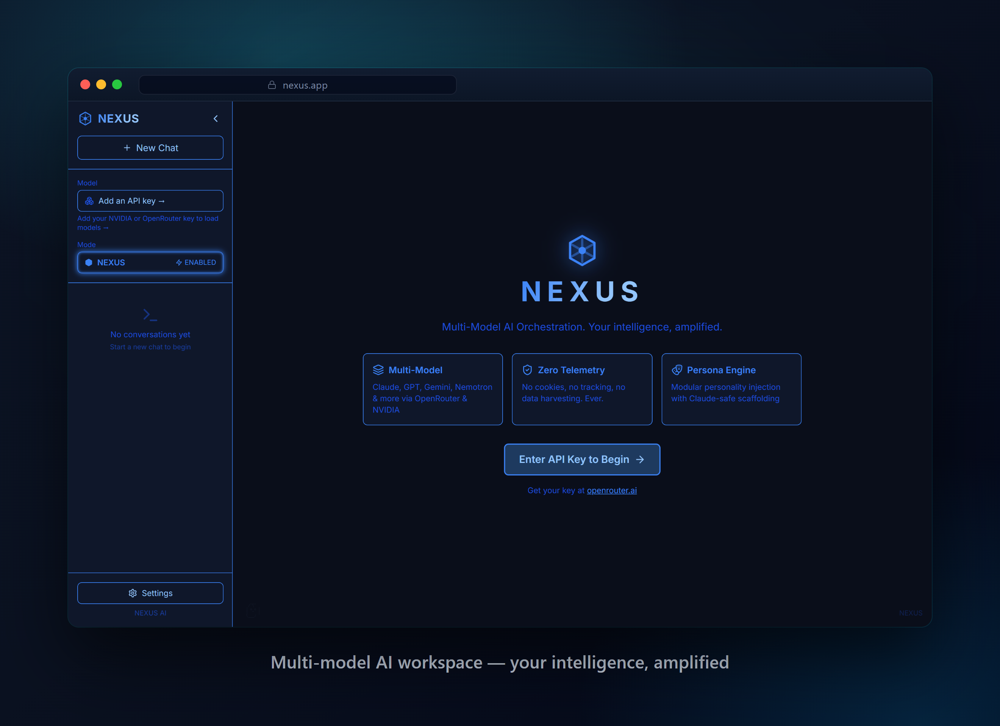
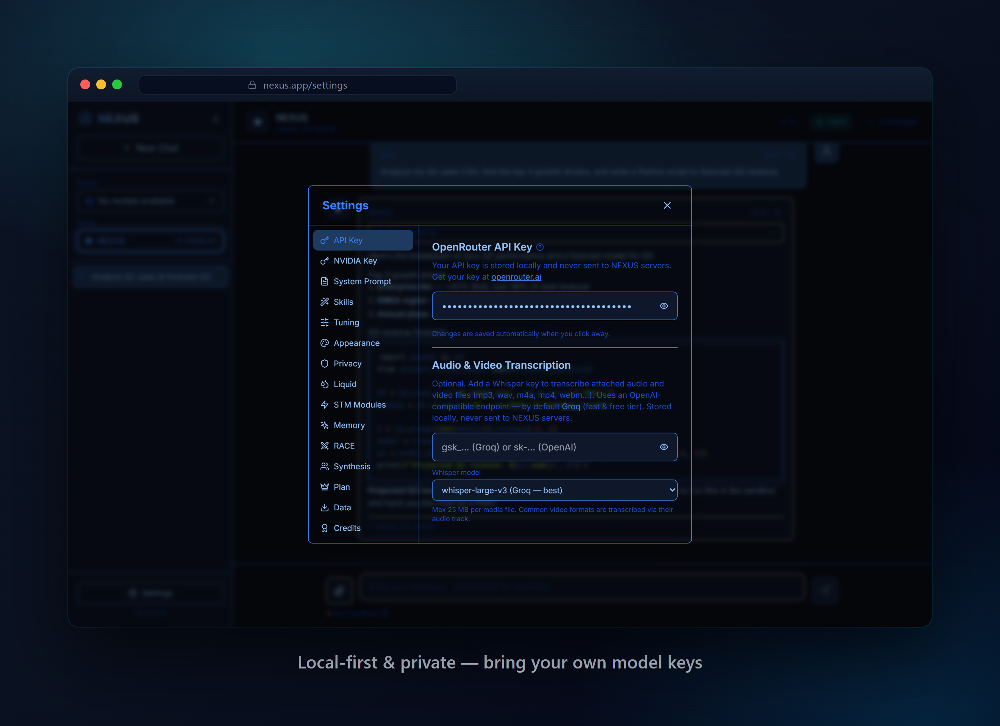

# NEXUS

[](https://github.com/Victor00128/NEXUS/actions/workflows/ci.yml)
[](LICENSE)

**A multi-model AI workspace with an autonomous agent.** NEXUS combines chat,
file analysis, model routing, and sandboxed code execution in one interface.

[Try the live demo](https://nexus-exec.vercel.app/) ·
[Read the API guide](API.md) ·
[Report a security issue](SECURITY.md)

> The public demo is suitable for evaluating the interface. Model and sandbox
> features require your own provider keys, and availability depends on those
> external services.

<p align="center">
  
</p>

<p align="center">
  
  &nbsp;
  
</p>

## What it demonstrates

- **Autonomous agent workflow** — plans tasks, runs Python or shell commands in
  an isolated E2B sandbox, and returns generated files as downloadable artifacts.
- **Skill routing** — selects focused playbooks for web design, planning, data
  analysis, debugging, and autonomous execution.
- **Visible execution** — shows a collapsible reasoning summary and a live tool
  timeline so users can follow progress.
- **File analysis** — handles images, PDF, Word, Excel, CSV, audio/video, and
  common archive formats.
- **Multi-model orchestration** — can race supported models or synthesize their
  responses into one result.
- **Bring your own provider** — supports OpenRouter and NVIDIA NIM model keys.
- **Local-first settings** — chat data and provider configuration are stored in
  the browser, with backup export/import.

## Good fit for

NEXUS is useful as a reference or starting point for teams evaluating agentic
workflows that must analyze files, execute code in an isolated environment, and
return reviewable artifacts. It demonstrates the product flow and integration
boundaries; it is not presented as a turnkey multi-tenant SaaS.

Typical client work based on this evidence includes adding an AI workflow to an
existing product, connecting provider and sandbox APIs, designing visible tool
execution, and hardening loading, error, cancellation, and artifact-delivery states.

## Quick start

### Requirements

- Node.js 20 or newer
- An OpenRouter or NVIDIA NIM key for model-backed features
- An E2B API key for autonomous sandbox execution

```bash
git clone https://github.com/Victor00128/NEXUS.git
cd NEXUS
npm ci
cp .env.local.example .env.local
npm run dev
```

Open <http://localhost:3000>, then add your model provider key in **Settings**.
Add the E2B key to `.env.local` only when you want to exercise the agent:

```env
E2B_API_KEY=e2b_your_key_here
```

Never commit `.env.local` or a real provider key. The file is ignored by Git;
`.env.local.example` documents the expected variables without credentials.

## Runtime modes and limitations

- The autonomous agent needs server mode (`npm run dev` or `npm run start`) so
  the server-only agent route can reach the sandbox provider.
- A static export (`NEXT_STATIC_EXPORT=1 npm run build`) exposes the chat UI but
  cannot run the agent route.
- Browser-stored provider keys are appropriate for personal demos. A multi-user
  production deployment should move provider access, quotas, authentication,
  and audit controls behind a server.
- Generated output and model responses must be reviewed before they are trusted
  or used in a production workflow.
- CI validates lint, types, the security regression tests, and the production
  build. Those tests cover the consent and telemetry boundaries; end-to-end
  agent-behavior tests are not yet included.

## Quality checks

Every push and pull request runs all four steps
([workflow](.github/workflows/ci.yml)):

```bash
npm run lint       # next lint
npm run typecheck  # tsc --noEmit
npm test           # security regressions: consent + telemetry validation
npm run build      # Next.js production build
```

`tests/security-regressions.test.ts` pins the behaviour that must not regress:
dataset publication requires a literal `true`, telemetry events are schema
validated, origins are checked against an allowlist, and rate-limit keys never
collapse distinct clients.

## Architecture

```text
src/
  app/                Next.js app and server-only /api/agent route
  components/         Chat, messages, settings, and execution UI
  lib/
    agent.ts           Agent loop, sandbox tools, and artifact capture
    skills.ts          Skill playbooks and routing
    system-prompt.ts   NEXUS agent identity and constraints
    files.ts           Client-side file extraction
    openrouter.ts      OpenRouter provider integration
    nvidia.ts          NVIDIA NIM provider integration
    tuning*.ts         Context-aware model parameters
  store/               Zustand state persisted in localStorage
```

E2B provides the isolated execution environment; the orchestration and agent
loop in this repository are application code.

## Documentation

- [API guide](API.md)
- [Contributing](CONTRIBUTING.md)
- [Security policy](SECURITY.md)
- [Third-party notices](NOTICE.md)

## License and attribution

NEXUS is licensed under the **GNU Affero General Public License v3.0
(AGPL-3.0)**. See [LICENSE](LICENSE).

The interface and several features are based on
[G0DM0D3](https://github.com/elder-plinius/G0DM0D3) by elder-plinius, also
licensed under AGPL-3.0. Because NEXUS is a derivative work, it remains under
AGPL-3.0. If you distribute it or run a modified version as a network service,
review the license obligations and provide the corresponding source as required.
Full attribution is available in [NOTICE.md](NOTICE.md).
